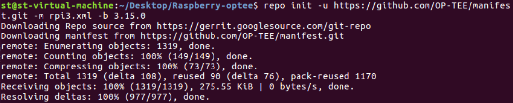
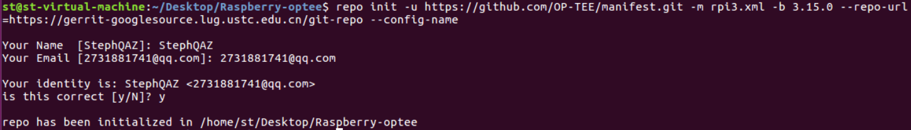
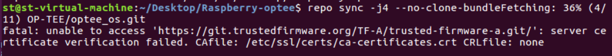
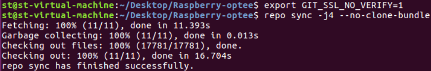
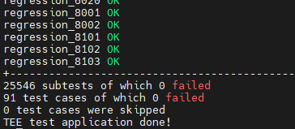
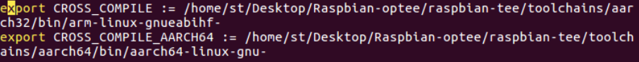
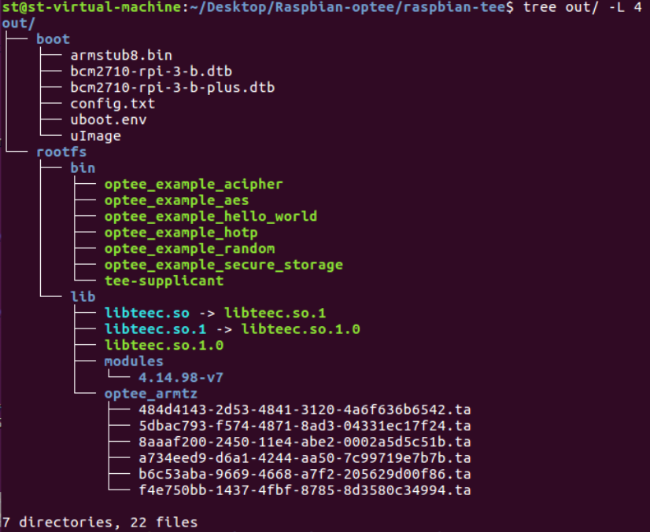
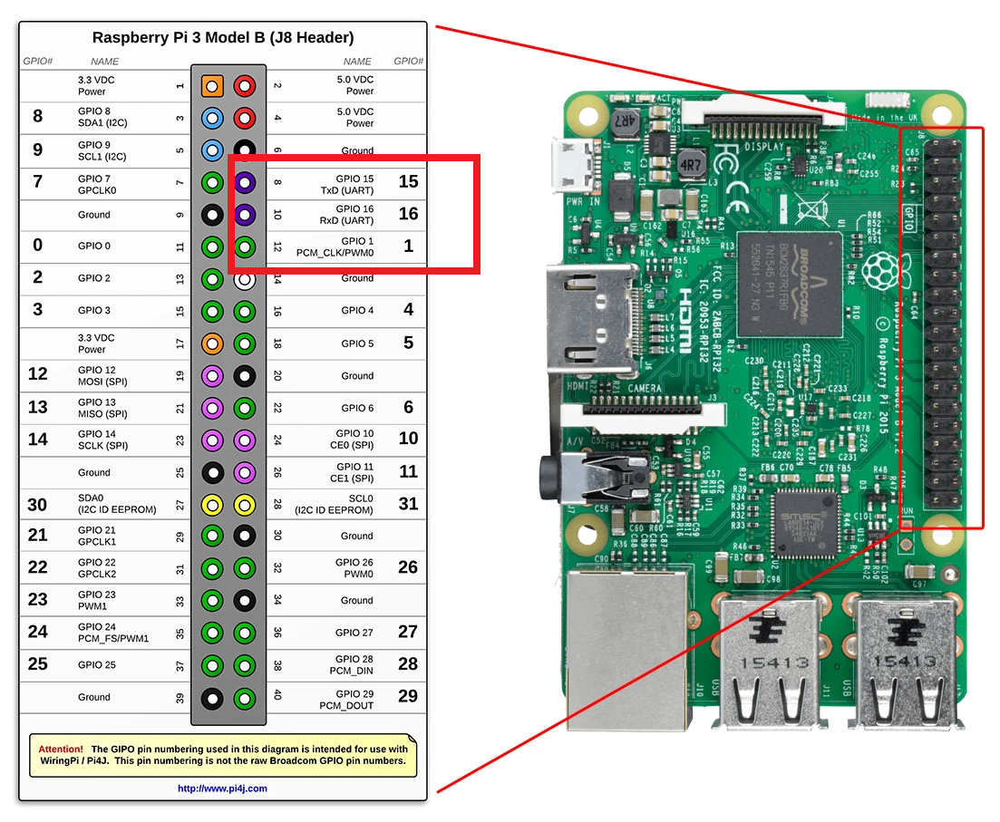

# RaspberryPi 3B安装OP-TEE

该文档将描述如何安装OP-TEE并在树莓派3B上运行。

------

# 前提要求

如果虚拟机之前没有安装过op-tee，那么需要安装以下的依赖包。

```C
$ sudo dpkg --add-architecture i386
$ sudo apt-get update
$ sudo apt-get install android-tools-adb android-tools-fastboot autoconf \
        automake bc bison build-essential ccache codespell \
        cscope curl device-tree-compiler \
        expect flex ftp-upload gdisk iasl libattr1-dev libcap-dev \
        libfdt-dev libftdi-dev libglib2.0-dev libgmp-dev libhidapi-dev \
        libmpc-dev libncurses5-dev libpixman-1-dev libssl-dev libtool make \
        mtools netcat ninja-build python-crypto python3-crypto python-pyelftools \
        python3-pycryptodome python3-pyelftools python-serial python3-serial \
        rsync unzip uuid-dev xdg-utils xterm xz-utils zlib1g-dev
```

其中，`python3-pycryptodome`这个包可能会报错，如果报错了，可以把这个包删除，然后再apt-get install。

# 安装步骤

在这里我们提供两种安装方式。

- **OP-TEE官方安装**，是OP-TEE官网文档提供的为树莓派3b安装方式。该方式具有局限性，因为非安全世界的操作系统为Linux，不方便后续实验安装MQTT等库。
- **非官方安装【建议采用】**，是github开源的OP-TEE在树莓派上安装方式。在这种安装方式下，非安全世界的操作系统为树莓派官方操作系统Raspberry Pi OS，非常适合进行实验。

## OP-TEE官方安装
### 安装环境

**虚拟机：ubuntu16.04 64位**

**硬盘大小： ** **建议20G以上**

**树莓派型号：RaspberryPi 3/3B**【注意：树莓派4B不支持】

**OP-TEE版本**：**v3.12.0**

### repo init

为了快速安装我们需要的多个git仓库，可以使用optee官方提供的repo来快速获得所需要的git仓库。

**第一步**需要初始化optee官方提供的repo，该repo地址为

[OP-TEE/manifest: Manifests to use OP-TEE on various platforms (github.com)](https://github.com/OP-TEE/manifest)

需要新建一个文件夹，其中，<optee-project>替换为自己工程文件夹，并在该文件夹中输入repo init。

```C
$ mkdir -p <optee-project>
$ cd <optee-project>
$ repo init -u https://github.com/OP-TEE/manifest.git -m ${TARGET}.xml [-b ${BRANCH}] 
```

其中第3行的repo init可以`-m`后的参数可以指定硬件平台，因为我们想使用树莓派3，那么此处为rpi3，`-b`后的参数可以选择版本号，我们可以输入3.12.0。

```C
repo init -u https://github.com/OP-TEE/manifest.git -m rpi3.xml -b 3.12.0 
```



### repo sync

repo init成功后，需要进行repo sync来真正下载git仓库。命令为：

```C
$ repo sync -j4 --no-clone-bundle
```

我的repo源是https://gerrit.googlesource.com/git-repo，如果因为网络问题下载失败，可以重新repo init，带上参数 --repo-url=https://gerrit-googlesource.lug.ustc.edu.cn/git-repo【中科大的源】



然后再运行$ repo sync -j4 --no-clone-bundle。我这里出现了证书错误。



原因是不信任我本地的git账号，可以通过运行命令行$export GIT_SSL_NO_VERIFY=1，暂时将验证关闭。



### 安装toolchains

```C
$ cd <optee-project>/build
$ make -j2 toolchains
```

### make

```C
$ make -j4
```

### 烧写sd卡

运行 **$make img-help**，可以打印出如下的官方给的分区操作步骤。

```C
$ fdisk /dev/sdx   # where sdx is the name of your sd-card
   > p             # prints partition table
   > d             # repeat until all partitions are deleted
   > n             # create a new partition
   > p             # create primary
   > 1             # make it the first partition
   > <enter>       # use the default sector
   > +64M          # create a boot partition with 64MB of space
   > n             # create rootfs partition
   > p
   > 2
   > <enter>
   > <enter>       # fill the remaining disk, adjust size to fit your needs
   > t             # change partition type
   > 1             # select first partition
   > e             # use type 'e' (FAT16)
   > a             # make partition bootable
   > 1             # select first partition
   > p             # double check everything looks right
   > w             # write partition table to disk.

run the following as root
   $ mkfs.vfat -F16 -n BOOT /dev/sdx1
   $ mkdir -p /media/boot
   $ mount /dev/sdx1 /media/boot
   $ cd /media
   $ gunzip -cd /home/st/Desktop/Raspberry-optee3.12/build/../out-br/images/rootfs.cpio.gz | sudo cpio -idmv "boot/*"
   $ umount boot

run the following as root
   $ mkfs.ext4 -L rootfs /dev/sdx2
   $ mkdir -p /media/rootfs
   $ mount /dev/sdx2 /media/rootfs
   $ cd rootfs
   $ gunzip -cd /home/st/Desktop/Raspberry-optee3.12/build/../out-br/images/rootfs.cpio.gz | sudo cpio -idmv
   $ rm -rf /media/rootfs/boot/*
   $ cd .. && umount rootfs
```

按照上述过程给sd卡分区即可。

###  启动树莓派

先用usb-ttl线连接树莓派和电脑，tx对rx，rx对tx，波特率设置115200，其余默认。注意gnd和gnd也要连接，否则可能出现乱码。

上电后，通过putty或者picocom串口即可看到boot的log信息，boot完成后可以通过 **root** 账号或者 **test** 账号登陆。

### 运行xtest

启动后，可以通过xtest命令来对optee进行测试。树莓派命令行输入：

```c
 $ xtest
```

则会运行optee的测试，如果前面步骤均成功，则显示 0 failed。



### OP-TEE Demo

```c
$optee_example_hello_world // CA传递一个value给TA，TA将该value+1。
$optee_example_acipher         
$optee_example_aes             
$optee_example_hotp  
$optee_example_random
$optee_example_secure_storage // CA传递字符串给TA，TA将其存储在trustzone
```

###  树莓派配置以太网

个人配置的网络参数：

+ 设置树莓派ip地址：10.214.131.171
+ netmask：255.255.255.0
+ gateway：10.214.131.1
+ dns：10.10.0.21，10.10.0.8

```c
$ ifconfig eth0 10.214.131.171 netmask 255.255.255.0 //配置ip地址和子网掩码
$ route add default gw 10.214.131.1 //网关
$ echo "nameserver 10.10.0.21" > /etc/resolv.conf //dns
$ echo "nameserver 10.10.0.8" >> /etc/resolv.conf
```

##  非官方安装

###  安装环境

**虚拟机：**ubuntu16.04或更新

**交叉编译工具** Toolchain

**树莓派版本**：3B/3B+

**克隆仓库**

```
git clone https://github.com/benhaz1024/raspbian-tee.git
```

在 **config.mk** 文件里，将AARCH64和AARCH32路径修改成自己的toolchain路径



运行  **./prepare-env.sh** 

【 **如果尚未安装toolchains** 】可以通过make 以下Makefile文件进行安装。

```cmake
################################################################################
# Toolchains
################################################################################
ROOT				?= $(CURDIR)/..
TOOLCHAIN_ROOT 			?= $(ROOT)/toolchains

AARCH32_PATH 			?= $(TOOLCHAIN_ROOT)/aarch32
AARCH32_CROSS_COMPILE 		?= $(AARCH32_PATH)/bin/arm-linux-gnueabihf-
AARCH32_GCC_VERSION 		?= gcc-arm-9.2-2019.12-x86_64-arm-none-linux-gnueabihf
SRC_AARCH32_GCC 		?= https://developer.arm.com/-/media/Files/downloads/gnu-a/9.2-2019.12/binrel/$(AARCH32_GCC_VERSION).tar.xz

AARCH64_PATH 			?= $(TOOLCHAIN_ROOT)/aarch64
AARCH64_CROSS_COMPILE 		?= $(AARCH64_PATH)/bin/aarch64-linux-gnu-
AARCH64_GCC_VERSION 		?= gcc-arm-9.2-2019.12-x86_64-aarch64-none-linux-gnu
SRC_AARCH64_GCC 		?= https://developer.arm.com/-/media/Files/downloads/gnu-a/9.2-2019.12/binrel/$(AARCH64_GCC_VERSION).tar.xz

# Download toolchain macro for saving some repetition
# $(1) is $AARCH.._PATH		: i.e., path to the destination
# $(2) is $SRC_AARCH.._GCC	: is the downloaded tar.gz file
# $(3) is $.._GCC_VERSION	: the name of the file to download
define dltc
	@if [ ! -d "$(1)" ]; then \
		mkdir -p $(1); \
		echo "Downloading $(3) ..."; \
		curl -s -L $(2) -o $(TOOLCHAIN_ROOT)/$(3).tar.xz; \
		tar xf $(TOOLCHAIN_ROOT)/$(3).tar.xz -C $(1) --strip-components=1; \
		(cd $(1)/bin && for f in *-none-linux*; do ln -s $$f $${f//-none} ; done;) \
	fi
endef

.PHONY: toolchains
toolchains: aarch32 aarch64

.PHONY: aarch32
aarch32:
	$(call dltc,$(AARCH32_PATH),$(SRC_AARCH32_GCC),$(AARCH32_GCC_VERSION))

.PHONY: aarch64
aarch64:
	$(call dltc,$(AARCH64_PATH),$(SRC_AARCH64_GCC),$(AARCH64_GCC_VERSION))

CLANG_PATH			?= $(ROOT)/clang-9.0.1

# Download the Clang compiler with LLVM tools and compiler-rt libraries
define dl-clang
	@if [ ! -d "$(1)" ]; then \
		./get_clang.sh $(1); \
	else \
		echo "$(1) already exists"; \
	fi
endef

.PHONY: clang-toolchains
clang-toolchains:
	$(call dl-clang,$(CLANG_PATH))
```


###  编译

运行 **./prepare-env.sh** 后，会自动下载所需的git仓库。

下载完成后，命令行输入 **make patch**，打上补丁。

最后命令行输入 **make**。

这里可能会出现make指令报错：

```c
make[1]: Leaving directory '/home/st/Desktop/Raspbian-optee/raspbian-tee/linux'
mkimage -A arm -O linux -T kernel -C none -a 0x02000000 -e 0x02000000 -n "linux kernel image" -d /home/st/Desktop/Raspbian-optee/raspbian-tee/linux/arch/arm/boot/zImage /home/st/Desktop/Raspbian-optee/raspbian-tee/linux/arch/arm/boot/uImage
/bin/sh: mkimage: command not found
Makefile:157: recipe for target 'linux-uimage' failed
make: *** [linux-uimage] Error 127

```

解决办法：根据[编译内核提示mkimage command not found – U-Boot images will not be built_wiwa@tech-CSDN博客](https://blog.csdn.net/eibo51/article/details/51901480?utm_medium=distribute.pc_relevant.none-task-blog-2~default~baidujs_title~default-0.essearch_pc_relevant&spm=1001.2101.3001.4242.1)描述，通过“**sudo apt-get install u-boot-tools**”，即可make成功。

make需要一段时间，如果最后make成功，out文件夹里的文件如图所示。



###  烧写SD卡

### 烧写Raspbian os

在[Index of /raspbian/images (raspberrypi.org)](http://downloads.raspberrypi.org/raspbian/images/?C=N;O=D)该网站下有树莓派的所有历史镜像，选择其中的 **2019-07-12-raspbian-buster-lite.zip**，进行下载。下载完成后解压得到**2019-07-12-raspbian-buster-lite.img**。

将sd卡插入pc上，并使用以下任一烧写工具将镜像烧写在sd卡里即可

+ 树莓派官方烧写工具 **Raspberry Pi Imager**【[Raspberry Pi OS – Raspberry Pi](https://www.raspberrypi.com/software/)】
+ balenaEtcher【[balenaEtcher - Flash OS images to SD cards & USB drives](https://www.balena.io/etcher/)】

### 拷贝虚拟机里out文件夹里的文件

将带有Raspbian OS的sd卡挂载到虚拟机中，此时sd卡两个分区应该自动挂载到 /media/user/boot 和 /media/user/rootfs。【其中user为自己的用户名】

执行下面命令：

```c
$ sudo cp -rf ./out/boot/* /media/user/boot
$ sudo cp -rf ./out/rootfs/* /media/user/rootfs
```

拷贝完成后，进行umount。

```
$ sudo umount /dev/sdx1 // x 视自己设备名设定
$ sudo umount /dev/sdx2
```

###  启动树莓派3B

将sd卡插入树莓派中，并用usb转ttl线连接串口，如图连接uart。



pc机的uart波特率设置为115200，其余默认。

上电后，uart能打印boot信息。树莓派账号为 pi，密码为 raspberry。

**测试op-tee是否正常**

登录账号后，命令行输入

```c
$ ls /dev/tee* 
// 此时终端应能打印出 /dev/tee0 和 /dev/teepriv0
$ sudo tee-supplicant & 
// 这一步将optee在REE端的驱动放在后台运行
$ sudo optee_example_hello_world
// 这一步运行hello world例程，终端会打印出一系列信息和 数字43
```

如果上述过程没有任何异常，则raspbian和optee安装成功。

# 参考

[apply OPTEE to raspbian · Issue #3557 · OP-TEE/optee_os (github.com)](https://github.com/OP-TEE/optee_os/issues/3557)

[Using OPTEE with Raspbian · Issue #3849 · OP-TEE/optee_os (github.com)](https://github.com/OP-TEE/optee_os/issues/3849)

[boot problem · Issue #7 · benhaz1024/raspbian-tee (github.com)](https://github.com/benhaz1024/raspbian-tee/issues/7)

[benhaz1024/raspbian-tee: Raspbian with OP-TEE support. (github.com)](https://github.com/benhaz1024/raspbian-tee)

[在树莓派3B Raspbian 完整系统上运行OPTEE - 知乎 (zhihu.com)](https://zhuanlan.zhihu.com/p/147061445)

[build — OP-TEE documentation documentation (optee.readthedocs.io)](https://optee.readthedocs.io/en/3.15.0/building/gits/build.html#build)

[Raspberry Pi 3 — OP-TEE documentation documentation (optee.readthedocs.io)](https://optee.readthedocs.io/en/3.12.0/building/devices/rpi3.html)
